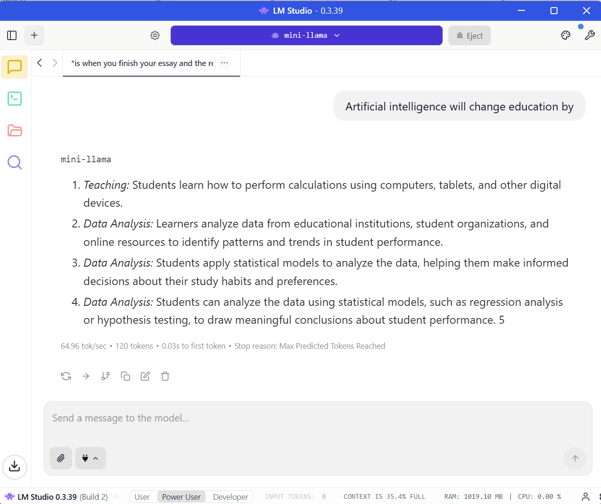

# Generate Examples & GGUF Model Usage

*Trimester 3, 2025*

Planner task: [Link to MS Planner](https://planner.cloud.microsoft/webui/v1/plan/uYcXdi9j10q2XjnDautR7MgAFL1s/view/board/task/YU9bZHtRQEGNPgmoWrHPhsgAKz35?tid=d02378ec-1688-46d5-8540-1c28b5f470f6).  

**Project Leads:** Thai Ha NGUYEN, David Tenni, Matthew O’Donnell.  
**Document contribution:** Thai Ha NGUYEN.

## Objective

1. Generate qualitative text samples from the trained Mini-LLaMA model for reporting and appendix use.
2. Convert the trained model to **GGUF format** and demonstrate how to **run inference locally** using **Ollama** or **LM Studio**.

# Complete trained Mini-LLM model

- Download `.pt` model (**Best**): [Mini-LLM-AAIE .pt model](https://deakin365.sharepoint.com/:u:/r/sites/Deakin-MITHackathon/Shared%20Documents/AAIE%20-%20Artificial%20Assessment%20Intelligence%20for%20Educ/Mini-LLM%20model/Pytorch%20Model/step_6000.pt?csf=1&web=1&e=uS8hGi)

- Download `.gguf` model: [Mini-LLM-AAIE .gguf model](https://deakin365.sharepoint.com/:u:/r/sites/Deakin-MITHackathon/Shared%20Documents/AAIE%20-%20Artificial%20Assessment%20Intelligence%20for%20Educ/Mini-LLM%20model/GGUF%20Model/mini-llama.gguf?csf=1&web=1&e=EpQADM)

## Part A — Generating Text Examples

### Purpose

Generated examples provide **qualitative evidence** of language modeling capability and are typically included in:

* Appendix sections of reports
* Model cards
* Demonstrations for mentors or stakeholders

### Prompt Configuration

Text generation prompts are defined directly in the evaluation script.

```python
# -----------------------------
# Prompts for Appendix
# -----------------------------
PROMPTS = [
    "Artificial intelligence is transforming the way",
    "In recent years, large language models have",
    "The future of technology depends on",
    "Once upon a time, there was a small robot that",
    "Machine learning models often struggle when",
]
```

#### How to Add or Modify Prompts

* Add new prompts as additional strings in the `PROMPTS` list.
* Prompts should be **prefix-based** (unfinished sentences) to evaluate continuation quality.
* Keep prompts short and neutral to avoid biasing generation.

Example:

```python
PROMPTS.append("Reinforcement learning agents must balance")
```

### Running the Generation Script

Execute the following command from the project root:

```bash
python -m evaluation.generate_examples
```

### Expected Output

```text
✍️ Generating samples on cuda
→ Prompt 1
→ Prompt 2
→ Prompt 3
→ Prompt 4
→ Prompt 5
```

* The script loads the **latest checkpoint**.
* Each prompt is passed through the model sequentially.
* Generated outputs are printed to stdout and/or saved depending on script configuration.

### Usage in Reports

* Copy generated text into the **Appendix: Qualitative Examples** section.
* Each example should include:

  * Prompt
  * Model continuation
* Do not cherry-pick outputs; include all prompts for transparency.


## Part B — Converting Model to GGUF & Local Inference

### Purpose of GGUF

GGUF is an inference-optimized format compatible with:

* **Ollama**
* **LM Studio**
* `llama.cpp`-based runtimes

This allows fast, local inference without Python or PyTorch.


## Step 1 — Convert Model to GGUF

> Assumes you have a final checkpoint (e.g. `step_6000.pt`) and a compatible conversion script.

Typical workflow:

1. Export PyTorch weights to a HuggingFace-style format
2. Convert to GGUF using `llama.cpp` tools

Example (conceptual):

```bash
python convert_to_gguf.py \
  --checkpoint checkpoints/step_6000.pt \
  --output mini-llama.gguf
```

Result:

```text
mini-llama.gguf
```

## Step 2 — Using GGUF Model in Ollama

### Create a Modelfile

Create a file named `Modelfile`:

```text
FROM ./mini-llama.gguf

PARAMETER temperature 0.7
PARAMETER top_p 0.9
PARAMETER stop "</s>"
```

### Build the Model

```bash
ollama create mini-llama -f Modelfile
```

### Run Inference

```bash
ollama run mini-llama
```

You can now interact with the model directly from the terminal.

---

## Step 3 — Using GGUF Model in LM Studio

1. Open **LM Studio**
2. Go to **Models → Add Model**
3. Select the file:

   ```
   mini-llama.gguf
   ```
4. Choose:

   * Context length (e.g. 2048)
   * Temperature / Top-p as needed
5. Start chatting with the model

No additional configuration is required.


## Validation Checklist

* Text generation examples produced successfully
* Prompts easily extensible and reproducible
* Model converted to GGUF format
* GGUF model runnable in Ollama
* GGUF model usable in LM Studio


## Notes & Next Steps

* Generated examples can be expanded for:

  * Domain-specific prompts
  * Instruction-following tests

* GGUF models can later be:

  * Quantized (Q4, Q5, Q8)
  * Deployed on lower-memory devices

* Next recommended ticket:
  **Instruction Fine-Tuning + GGUF Quantization**

# Appendix: Qualitative Text Generation Examples

## Examples from Pytorch model `.pt`

```text
Appendix: Qualitative Text Generation Examples
=======================================================

Example 1
------------------------------
Prompt:
Artificial intelligence is transforming the way

Generated Text:
Artificial intelligence is transforming the way humans work, especially in areas like computer science, engineering, and even social sciences! By harnessing the power of AI, scientists can gain access to vast opportunities for learning and growth. For example, you might be able to design a mobile app that allows users to access and manage files, making it easier to navigate and collaborate with colleagues. Or if you're running a small business, how does the software make you feel connected to other people's work?

But AI isn't just about finding the perfect fit. It's also about learning how to interpret and improve its own systems. When we

Example 2
------------------------------
Prompt:
In recent years, large language models have

Generated Text:
In recent years, large language models have gained significant traction within anthropological circles, often referred to as "sociologos" due to their reliance on visual cues and semantic meaning. However, these methods often fall short in capturing the nuances of social reality, leading to oversimplification and overlooks important contextual factors influencing communication (Kohn & Shammas, 2007; Hill, 2000). Consequently, we propose an alternative conceptualization of social reality that acknowledges both the affordances and limitations of such analytical tools.

Defining Social Context:
Social context refers to the broader sociohistorical context within which social phenomena are situated. It

Example 3
------------------------------
Prompt:
The future of technology depends on

Generated Text:
The future of technology depends on several factors, including:

* **New Technology:** If everyone starts using computers and other tools, the world will be more creative and efficient, allowing you to do your job faster and more efficiently.
* **Information Technology (IT):** Imagine if all that effort was done with just one phone instead of one – wouldn’t it be cool? The same goes for innovation and progress.
* **Knowledge Economy:** There is an increasing global economy, where countries can do useful work by harnessing their own technology. This means that talented workers can help increase productivity and

Example 4
------------------------------
Prompt:
Once upon a time, there was a small robot that

Generated Text:
Once upon a time, there was a small robot that built all sorts of gadgets. This robot had a special ability to make sense of everything - from its energy levels to temperatures!

One day, a robot named Ada wanted to show off her amazing abilities to the robot. She knew that if she could do things faster or better, she would become stronger and smarter. But how did this happen? Let's find out!

First, let's understand what we mean by "power." Imagine you're throwing a ball; if you throw it hard and harder, it takes more effort to fall down. That's exactly what power does! It

Example 5
------------------------------
Prompt:
Machine learning models often struggle when

Generated Text:
Machine learning models often struggle when confronted with large datasets containing numerous variables and nested dependencies. Consequently, alternative approaches like those based on probabilistic models have emerged as promising alternatives worthy of serious consideration (Hastie, 2015). However, despite these advancements, concerns remain regarding interpretability, generalizability, and generalizability across different contexts (Fernández, 2014). As such, while the present paper offers valuable insights, further research is required to ascertain how best to integrate these novel approaches into existing frameworks.

2. Methodology

To achieve our objectives, we analyzed the dataset comprising all relevant decision

Example 6
------------------------------
Prompt:
What is Artificial Intelligence?

Generated Text:
What is Artificial Intelligence?

In order to understand technology, it is important to first define what we mean by technology. At its core, technology refers to a set of activities that enable human interaction, interaction, and innovation. It includes various tools, machinery, software applications, and the development of artificial intelligence (AI) technology. These technologies can range from smartphones to tablets, such as laptops and tablets, and are often used by businesses to work with customers, investors, employees, and employees.

One of the primary ways technology can be used is through its impact on the economy. For example, the production of
```

## Examples from LMStusio `.gguf`


